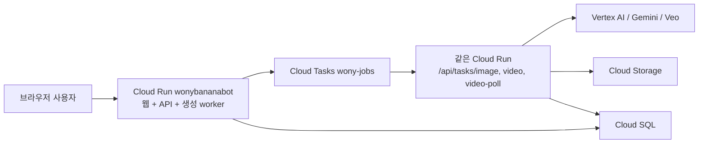
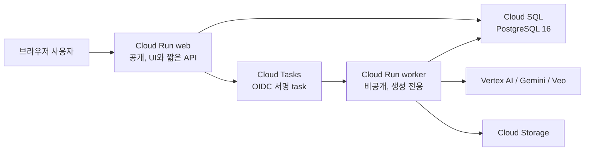

# GCP 데이터베이스 상향 및 생성 Worker 분리 상세 보고서

- 기준일: 2026-07-17 (KST)
- GCP 프로젝트: `wonybananabot`
- 리전: `asia-northeast3` (서울)
- 대상 서비스: Cloud Run `wonybananabot`, Cloud SQL `wony-postgres`, Cloud Tasks `wony-jobs`
- 상태: **조사 및 권장안만 작성했으며 아직 인프라 변경은 수행하지 않음**

## 1. 결론

두 제안은 목적과 긴급도가 다르다.

1. **Cloud SQL 상향은 이미 발생한 장애를 해결하는 작업이다.**
   - 현재 `db-f1-micro`의 PostgreSQL 기본 최대 연결은 25개다.
   - 실제 최근 최대 연결은 22개였고, 로그에서 일반 사용자가 사용할 수 있는 연결 슬롯이 소진된 오류가 두 차례 확인됐다.
   - 자동 백업, PITR, 삭제 방지도 모두 꺼져 있다.
   - 권장안은 PostgreSQL 16은 그대로 두고 머신만 `db-custom-1-3840`으로 변경하는 것이다.

2. **Cloud Run web/worker 분리는 생성량 증가에 대비한 격리와 통제 작업이다.**
   - 비동기 job 및 Cloud Tasks 구조는 이미 구현돼 있다.
   - 하지만 Cloud Tasks가 다시 같은 공개 Cloud Run 서비스의 `/api/tasks/*`를 호출한다.
   - 이미지 생성 한 작업은 내부에서 최대 5개의 모델 요청을 동시에 실행하고, base64 이미지·Sharp 합성·썸네일 생성을 같은 1GiB 컨테이너에서 처리한다.
   - 웹 요청과 생성 작업을 다른 Cloud Run 서비스로 배포하면 생성 부하가 로그인, 화면 조회, 저장 API를 밀어내지 못하게 할 수 있다.

권장 실행 순서는 **DB 보호 설정 및 상향 → worker 인증 보강 → worker 분리 → 동시성 부하 테스트**다.

## 2. 현재 운영 상태

### 2.1 Cloud SQL

| 항목 | 현재 값 | 판단 |
| --- | --- | --- |
| 엔진 | PostgreSQL 16 | 유지 |
| 머신 | `db-f1-micro` | 상향 필요 |
| CPU/RAM | shared vCPU / 614.4MiB | 운영 여유 부족 |
| edition | Enterprise | 유지 |
| 가용성 | ZONAL, `asia-northeast3-c` | 개인 프로젝트 초기 단계에서는 유지 가능 |
| 디스크 | 10GiB SSD, 자동 증설 사용 | 현재 사용량 약 76.7MB로 여유 있음 |
| 자동 백업 | 꺼짐 | 즉시 활성화 필요 |
| PITR | 꺼짐 | 활성화 필요 |
| 삭제 방지 | 꺼짐 | 활성화 필요 |
| 연결 방식 | Cloud Run built-in Cloud SQL 연결 | 유지 |
| Public IP | 사용 | 현재 Auth Proxy 경로는 암호화되나 정책 보강 필요 |
| SSL mode | 암호화/비암호화 모두 허용 | connector 검증 후 `ENCRYPTED_ONLY` 권장 |

### 2.2 Cloud Run

| 항목 | 현재 값 |
| --- | --- |
| 서비스 | `wonybananabot` 하나 |
| CPU/RAM | 1 vCPU / 1GiB |
| 요청 동시성 | 인스턴스당 80 |
| timeout | 600초 |
| 최소 인스턴스 | 0 |
| 최대 인스턴스 | 4 |
| ingress | all |
| 인증 | 서비스 전체는 `allUsers` invoker, task route는 공유 token 검사 |
| Cloud SQL pool | 인스턴스당 Prisma `connection_limit=5` |

### 2.3 Cloud Tasks

| 항목 | 현재 값 |
| --- | --- |
| queue | `wony-jobs` |
| 최대 dispatch | 초당 5 |
| 최대 동시 작업 | 10 |
| 최대 시도 | 5회 |
| backoff | 10초~300초 |
| 작업 대상 | 현재 웹 서비스와 동일한 Cloud Run URL |

## 3. 실제 지표와 로그

현재 revision이 배포된 당일 데이터만 존재하므로 장기 용량 예측에는 부족하지만, 현재 문제의 성격을 구분하기에는 충분하다.

### 3.1 Cloud Run 관측값

약 8시간 집계:

- 총 요청: 1,485건
- HTTP 500: 4건, 모두 `/api/generate`, 전체의 약 0.27%
- 시간별 p95 요청 지연의 최대값: 약 3.31초
- 시간별 p95 CPU 사용률 최대값: 약 12.4%
- 시간별 p95 memory 사용률 최대값: 약 26.0%
- 시간별 p95 동시 요청 최대값: 약 11.3
- 최대 인스턴스 수: 2

현재 일반 웹 트래픽만 보면 CPU나 컨테이너 메모리가 포화된 상태는 아니다. 단, Cloud Run의 request latency 지표는 container startup latency를 포함하지 않으며, 아직 생성 작업량도 매우 적다.

### 3.2 Cloud SQL 관측값

약 11시간 집계:

- CPU 최대 사용률: 약 8.2%
- memory utilization: 지속적으로 100%
- PostgreSQL backend connection 최대: 22개
- `db-f1-micro`의 기본 `max_connections`: 25개
- 디스크 사용량: 약 76.7MB / 10GiB

로그에서 아래 유형의 오류가 두 차례 확인됐다.

```text
remaining connection slots are reserved for roles with privileges of the
"pg_use_reserved_connections" role
```

즉 CPU와 디스크가 아니라 **RAM과 connection headroom이 먼저 소진됐다.** 현재 Cloud Run 최대 4개 인스턴스가 각각 Prisma pool 5개를 가지면 애플리케이션 연결만 최대 20개가 된다. 여기에 배포 중 구·신 revision 중첩, 관리 연결, migration 또는 콘솔 접근이 더해지면 기본 한도 25개에 바로 닿는다.

### 3.3 Cloud Tasks 관측값

- queue depth 최대: 2
- Cloud Tasks 실제 전달 시도: 11회
- 성공 200: 2회
- 인증 실패 401: 5회
- 요청 검증 실패 400: 4회

Cloud Monitoring에서는 성공 2회, `unavailable` 9회로 집계됐다. 이 9회는 로그의 Cloud Tasks 401/400과 수가 일치한다. 현재 실패는 자원 timeout이 아니라 공유 token 불일치와 request payload 계약 문제였다.

따라서 worker 분리 시 단순히 URL만 바꾸면 안 되며, **Google 서명 OIDC 인증과 task payload 테스트를 같이 적용해야 한다.**

## 4. Cloud SQL `db-f1-micro` 상향

### 4.1 왜 상향하는가

`db-f1-micro`는 shared-core 1 vCPU와 0.614GB RAM을 제공한다. Google은 `db-f1-micro`와 `db-g1-small`을 Cloud SQL SLA 대상에서 제외하며 개발·테스트 성격의 머신으로 분류한다.

현재 애플리케이션에서는 이미 다음 한계가 실제로 드러났다.

- 메모리 지표가 지속 100%다.
- PostgreSQL connection이 기본 25개 중 22개까지 올라갔다.
- 실제 connection slot exhaustion 오류가 발생했다.
- 향후 web과 worker를 분리하면 DB connection pool을 가진 Cloud Run 서비스가 하나 더 생긴다.

PostgreSQL 메이저 버전은 문제가 아니므로 16을 유지한다. 데이터 이전도 필요 없고, 같은 인스턴스의 머신 크기만 변경한다.

### 4.2 권장 머신

**권장: `db-custom-1-3840`**

- dedicated 1 vCPU
- 3.75GiB RAM
- PostgreSQL 기본 `max_connections` 100
- 현재보다 RAM 약 6.1배
- shared-core 머신이 아니므로 운영 기준에 적합
- 현재 10GiB SSD와 PostgreSQL 16은 그대로 유지

대안 비교:

| 선택 | RAM | 기본 DB 연결 | SLA 관점 | 핵심 월 예상액 | 판단 |
| --- | ---: | ---: | --- | ---: | --- |
| 현행 `db-f1-micro` | 0.614GiB | 25 | shared-core 미적용 | 약 $12.21 | 이미 한도 도달 |
| 임시 `db-g1-small` | 1.7GiB | 50 | shared-core 미적용 | 약 $35.43 | 저비용 임시안일 뿐 |
| 권장 `db-custom-1-3840` | 3.75GiB | 100 | dedicated core | 약 $66.32 | 권장 |
| `db-custom-1-3840` Regional HA | 3.75GiB x 2 | 100 | zone 장애 자동 failover | 약 $132 이상 | 현재 단계에서는 과함 |

월 예상액은 서울 리전 2026-07-17 Cloud Billing Catalog의 list price와 월 730시간을 기준으로 계산했다.

- `db-f1-micro`: $0.0137/시간
- `db-g1-small`: $0.0455/시간
- zonal dedicated vCPU: $0.0537/vCPU-시간
- zonal dedicated RAM: $0.0091/GiB-시간
- SSD: $0.221/GiB-월, 현재 10GiB

네트워크, 백업 증분 저장소, 세금, 환율 및 할인은 제외했다. 현재 실제 DB 데이터가 0.1GiB 미만이라 자동 백업 저장 비용은 당분간 매우 작다.

### 4.3 상향과 함께 반드시 적용할 설정

머신만 키우고 끝내지 않는다.

1. **즉시 on-demand backup 생성**
2. **자동 일일 백업 활성화**, 7개 이상 유지
3. **PITR 활성화**, transaction log 7일 유지
4. **삭제 방지 활성화**
5. Query Insights 활성화 후 slow query 확인
6. maintenance window 지정
7. Cloud Run 및 로컬 접속이 Auth Proxy/connector를 사용하는지 확인한 뒤 connector enforcement 적용
8. 직접 Public IP 접속이 없다면 `sslMode=ENCRYPTED_ONLY` 적용

현재 Cloud Run은 Cloud SQL built-in 연결을 사용하므로 그 경로는 Cloud SQL Auth Proxy에 의해 암호화·인증된다. Private IP/VPC 전환은 추가 비용과 네트워크 구성이 필요하므로 이번 작업의 필수 조건은 아니다.

### 4.4 변경 시 중단 시간

Cloud SQL Enterprise edition에서 CPU/RAM 크기 변경은 인스턴스를 재시작하며 공식 문서상 일반적으로 **60초 미만의 offline 시간**이 발생한다. 전체 변경 작업 표시는 수분간 진행될 수 있다.

권장 절차:

1. 사용량이 적은 시간 선택
2. 새 on-demand backup 완료 확인
3. 자동 백업/PITR/삭제 방지 적용
4. `db-custom-1-3840`으로 patch
5. Cloud SQL이 `RUNNABLE`이 될 때까지 새 배포와 migration 중지
6. 로그인, 캐릭터 조회, 생성 요청, credit transaction smoke test
7. connection, memory, CPU, DB error를 24시간 관찰

## 5. Cloud Run web/worker 분리

### 5.1 현재 구조



[job-engine.ts](../src/lib/job-engine.ts)는 `CLOUD_RUN_BASE_URL`에 `/api/tasks/*`를 붙여 task를 생성한다. 현재 이 URL은 공개 web 서비스 URL이다.

이미지 worker는 다음을 한 요청 안에서 처리한다.

- 캐릭터·배경·참조 이미지를 GCS에서 받아 base64로 메모리에 적재
- 사용자가 1~5장을 요청하면 최대 5개의 Gemini image 호출을 `Promise.allSettled`로 병렬 실행
- edit mask 생성 및 Sharp composite
- 원본과 WebP thumbnail 생성
- GCS 업로드
- DB transaction, credit 정산 및 실패 시 환불

따라서 Cloud Tasks 10개가 동시에 실행되고 각 job이 이미지 5장을 요청하면 이론적으로 최대 50개의 모델 호출이 동시에 시작될 수 있다. 현재 1CPU/1GiB 인스턴스가 웹 요청과 이 작업을 같이 받는 것이 구조적 위험이다.

### 5.2 권장 구조



별도 코드베이스를 만드는 것이 아니다. **같은 container image digest를 Cloud Run 서비스 두 개에 배포**한다.

- `wonybananabot-web`: 사용자 트래픽
- `wonybananabot-worker`: `/api/tasks/*` 처리

같은 image를 사용하면 기능 버전이 어긋나지 않고 build 비용과 배포 복잡성도 작다. 환경 변수 `SERVICE_ROLE=web|worker`로 허용 route만 구분한다.

### 5.3 시작 권장값

| 설정 | web | worker |
| --- | ---: | ---: |
| CPU | 1 vCPU | 1 vCPU |
| memory | 1GiB | 2GiB |
| concurrency | 20 | 1 |
| min instances | 0 | 0 |
| max instances | 4 | 2 |
| timeout | 300초 | 600초 |
| Prisma pool | 5 | 2 |
| public access | 허용 | 금지 |
| startup CPU boost | 사용 | 사용 |

Cloud Tasks 초기 권장값:

| 설정 | 현행 | 권장 시작값 |
| --- | ---: | ---: |
| max concurrent dispatches | 10 | 2 |
| max dispatches/sec | 5 | 2 |
| max attempts | 5 | 5 유지 |
| backoff | 10~300초 | 유지 |

근거:

- web은 실제 p95 동시 요청 최대가 약 11이므로 20이면 현재 트래픽을 한 인스턴스가 처리하면서도 80보다 일찍 scale-out한다.
- worker concurrency 1은 한 작업이 여러 대형 base64 buffer와 Sharp raw buffer를 보유하기 때문이다.
- worker 한 작업도 최대 5개 모델 호출을 병렬 실행하므로 동시 worker 2개면 모델 호출은 이미 최대 10개다.
- worker pool 2와 max instance 2라면 worker의 정상 DB 연결 상한은 약 4개다.
- web 4개 x pool 5 + worker 2개 x pool 2 = 정상 상태 최대 약 24개다. 새 DB 기본 한도 100 안에서 배포 중 구·신 revision 중첩까지 수용할 수 있다.

30일 지표를 쌓은 후 아래 조건을 만족할 때만 worker concurrency 또는 max instances를 올린다.

- worker memory p95 60% 미만
- job 성공률 99% 이상
- Vertex quota/429 없음
- queue 대기 시간이 UX 목표보다 큼
- DB connection p95 50% 미만

### 5.4 worker 인증

현재 task는 `X-Tasks-Token` 공유 secret을 사용한다. 이미 token 불일치로 401 retry가 발생했다. worker 분리 시 다음 방식으로 바꾼다.

1. `wony-tasks-invoker` 전용 service account 생성
2. worker 서비스에만 `roles/run.invoker` 부여
3. Cloud Tasks 생성 시 해당 service account의 OIDC token 포함
4. OIDC audience를 worker의 기본 `run.app` URL로 고정
5. worker는 `--no-allow-unauthenticated`
6. 안정화 후 `TASKS_AUTH_TOKEN` 제거

Google 서명 ID token은 만료·서명·audience를 Cloud Run IAM이 검증하므로 수동 공유 token보다 안전하고 배포 revision 간 token 불일치도 사라진다.

`X-CloudTasks-*` 헤더는 요청 출처의 신원 증명으로 사용하면 안 된다. task id와 job id는 재시도에 안전하도록 현재 idempotency 구조를 유지한다.

### 5.5 task payload 보강

현재 Cloud Tasks에서 400이 4회 발생했다. route는 body의 `jobId`가 string이 아니면 400을 반환한다.

분리 전에 다음을 추가한다.

- task body schema validator
- 민감정보를 제외한 `taskName`, `jobId`, retry count, body parse 결과 구조화 로그
- Cloud Tasks client가 생성한 bytes payload 통합 테스트
- worker `/api/tasks/health` OIDC smoke endpoint
- 400은 영구 payload 오류이므로 무의미하게 5회 재시도하지 않고 job fail/refund 처리
- 429/5xx/timeout만 backoff retry하도록 실패 분류

### 5.6 web에 남는 AI 기능

worker로 옮길 대상은 장시간 image/video generation job이다. 다음은 짧은 요청/응답 흐름이므로 우선 web에 유지한다.

- 캐릭터 디렉터 대화
- 일반 챗
- 프롬프트 추천·구조화
- OCR 및 문서 import 중 60초 이내 작업
- 로그인, 설정, 프로젝트·캔버스 CRUD

OCR/PDF import가 실제로 큰 문서에서 메모리를 많이 사용하면 이후 별도 document worker 후보로 측정한다.

## 6. 비용 영향

### 6.1 Cloud SQL

가장 큰 고정비 증가는 Cloud SQL이다.

- 현재 핵심 비용 추정: 약 $12.21/월
- 권장 머신 핵심 비용 추정: 약 $66.32/월
- 증가분: 약 $54.11/월, 세금·환율·백업·네트워크 제외

`db-g1-small`은 약 $35.43/월로 싸지만 여전히 shared-core이고 SLA 대상이 아니므로 최종 운영안으로 권장하지 않는다.

### 6.2 Cloud Run worker

web과 worker 모두 `min instances=0`, request-based billing을 쓰면 worker 서비스를 하나 더 만들었다는 이유만으로 고정 idle compute 비용이 생기지는 않는다.

다만 worker concurrency를 낮추면 같은 양의 작업을 더 많은 instance-second로 처리할 수 있어 생성량이 많을 때 Cloud Run compute 비용은 증가할 수 있다. 이는 웹 장애 격리와 예측 가능한 메모리 사용을 위해 지불하는 비용이다.

Cloud Run request-based free tier는 billing account 전체 기준으로 매월 다음을 제공한다.

- 2백만 requests
- 180,000 vCPU-seconds
- 360,000 GiB-seconds

Cloud Tasks는 월 100만 operation까지 무료다. 현재 규모에서는 worker 분리 자체보다 Vertex AI 생성 비용과 Cloud SQL 고정비가 전체 비용의 주요 항목이다.

web cold start가 실제 사용자 불만으로 확인되면 이후 web만 `min instances=1`을 검토한다. 이번 기본 권장안에서는 비용을 줄이기 위해 0을 유지한다.

## 7. 전환 계획

### 단계 A: DB 안전장치와 상향

1. 현재 지표 snapshot 보존
2. on-demand backup 생성 및 완료 확인
3. 자동 백업, PITR, 삭제 방지 활성화
4. `db-custom-1-3840`으로 상향
5. DB 연결 및 credit transaction smoke test
6. 24시간 memory, connection, error 감시

### 단계 B: worker 코드 준비

1. `WORKER_BASE_URL`, `SERVICE_ROLE`, OIDC service account 설정 추가
2. Cloud Tasks OIDC token 적용
3. task payload schema 및 구조화 로그 추가
4. task health endpoint 추가
5. image, video start, video poll 재시도 통합 테스트

### 단계 C: 비공개 worker 배포

1. web과 같은 검증된 image digest로 `wonybananabot-worker` 생성
2. 1CPU/2GiB, concurrency 1, min 0, max 2, timeout 600 설정
3. worker의 Cloud SQL, Storage, Vertex AI, Tasks 권한 확인
4. `allUsers` 권한 없이 OIDC invoker만 허용
5. health task와 무과금 smoke job 실행

### 단계 D: task 전환

1. queue 동시성 2, 초당 2로 낮춤
2. web의 새 task target을 worker URL로 전환
3. queue가 빈 상태에서 기존 web 대상 task drain 확인
4. 실제 이미지 1장, 5장, edit mask, video start/poll 실행
5. 실패·재시도·credit 환불 검증

### 단계 E: 안정화와 차단

1. web 서비스에서 `/api/tasks/*` 실행을 `SERVICE_ROLE`로 차단
2. 공유 `TASKS_AUTH_TOKEN` 제거
3. 7일간 queue delay, worker memory, Vertex 429, DB connection 관찰
4. 기준 충족 시 max worker instance를 2에서 3으로 단계적 상향 검토

## 8. rollback

### DB

머신 상향 후 성능 문제가 생길 가능성은 낮지만, 설정 patch 전 on-demand backup을 확보한다. 데이터 문제 시 새 인스턴스로 restore할 수 있다. 단순 머신 크기는 다시 낮출 수 있으나 connection과 memory 사용이 이미 현재 한도를 넘었으므로 `db-f1-micro`로의 rollback은 권장하지 않는다.

### worker

worker 전환은 DB migration이 없다.

- `WORKER_BASE_URL`을 기존 web URL로 되돌리면 새 task가 다시 기존 route로 간다.
- 이미 생성된 task는 생성 당시 URL을 유지하므로 queue drain 또는 purge 판단이 필요하다.
- 기존 web task route는 안정화 기간 동안 유지하므로 즉시 rollback할 수 있다.
- 같은 container image를 사용하므로 애플리케이션 버전 차이로 인한 rollback 위험이 작다.

## 9. 성공 기준

| 지표 | 목표 |
| --- | --- |
| Cloud SQL connection | 지속 70개 미만, 기본 한도 100 대비 30% 이상 여유 |
| Cloud SQL memory | p95 80% 미만 |
| Cloud SQL connection slot error | 0건 |
| 자동 백업 | 매일 성공, 최근 7개 이상 |
| worker task 401/400 | 0건 |
| generation job 성공률 | 99% 이상, 정책/모델 거절 제외 |
| queue depth | 정상 시 0~2, oldest task 지연 목표 이내 |
| worker memory | p95 60% 미만에서 시작 |
| web 5xx | 1% 미만 |
| web 정상 API p95 | 1초 이내 목표, AI 동기 endpoint 별도 집계 |

## 10. 최종 권장안

이번 프로젝트 규모와 개인 프로젝트라는 조건을 반영한 최종안은 다음과 같다.

- PostgreSQL 16 유지
- Cloud SQL은 zonal 유지, `db-custom-1-3840`으로 상향
- HA는 결제 출시 후 매출/가용성 요구가 생길 때 검토
- 자동 백업, PITR, 삭제 방지는 지금 적용
- web과 worker는 같은 image로 서비스만 분리
- worker는 비공개 OIDC 인증
- web concurrency 20, worker concurrency 1
- worker max instance 2, queue max concurrent 2로 보수적으로 시작
- 30일 지표 후에만 동시성 상향
- Next.js, Prisma, TypeScript, Node.js 메이저 전환은 수행하지 않음
- Instagram dead code도 이번 범위에서 제외

## 11. 공식 근거

- [Cloud SQL PostgreSQL 머신 시리즈](https://docs.cloud.google.com/sql/docs/postgres/machine-series-overview)
- [Cloud SQL instance 설정 변경 영향](https://docs.cloud.google.com/sql/docs/postgres/instance-settings)
- [Cloud SQL PostgreSQL 연결 관리](https://docs.cloud.google.com/sql/docs/postgres/manage-connections)
- [Cloud SQL PostgreSQL database flags와 기본 max_connections](https://docs.cloud.google.com/sql/docs/postgres/flags)
- [Cloud SQL PostgreSQL quota와 shared-core 제한](https://docs.cloud.google.com/sql/docs/postgres/quotas)
- [Cloud SQL 고가용성](https://docs.cloud.google.com/sql/docs/postgres/high-availability)
- [Cloud SQL과 Cloud Run 연결](https://docs.cloud.google.com/sql/docs/postgres/connect-run)
- [Cloud SQL SSL/TLS 설정](https://docs.cloud.google.com/sql/docs/postgres/configure-ssl-instance)
- [Cloud SQL 가격](https://cloud.google.com/sql/pricing)
- [Cloud Run concurrency](https://docs.cloud.google.com/run/docs/about-concurrency)
- [Cloud Run memory 설정](https://docs.cloud.google.com/run/docs/configuring/services/memory-limits)
- [Cloud Run request-based billing과 가격](https://cloud.google.com/run/pricing)
- [Cloud Run service-to-service OIDC 인증](https://docs.cloud.google.com/run/docs/authenticating/service-to-service)
- [Cloud Tasks HTTP target OIDC 인증](https://docs.cloud.google.com/tasks/docs/creating-http-target-tasks)
- [Cloud Tasks queue rate 설정](https://docs.cloud.google.com/tasks/docs/configuring-queues)
- [Cloud Tasks 가격](https://cloud.google.com/tasks/pricing)
