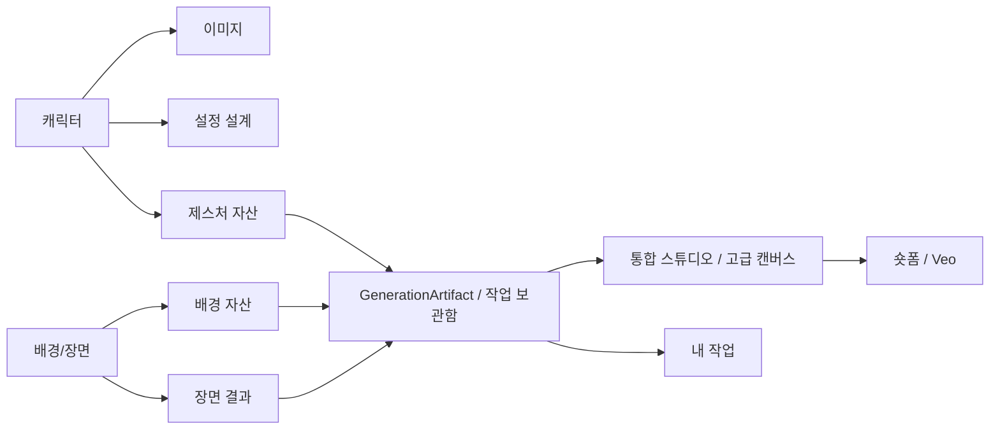

# WONY AutoCartoon 프로젝트 인수인계

작성 기준: 2026-07-24 KST

브랜치: `main`

GitHub: `https://github.com/n4topbada/autocartoon`
운영: `https://wonybananabot-272254743773.asia-northeast3.run.app`

이 문서는 다음 개발자가 현재 운영 구조, 실제 구현, 레퍼런스 차이, 남은 외부 결정을 빠르게 파악하기 위한 기준 문서다. 기능별 조사 근거와 AS-IS -> TO-BE 매트릭스는 [toonagent-reverse-engineering.md](./toonagent-reverse-engineering.md), 저장소 품질 기준은 [code-audit-2026-07-18.md](./code-audit-2026-07-18.md)에 있다.

## 1. 비밀과 접근 정보

- 레퍼런스: `https://app.toonagent.co.kr`
- 레퍼런스 ID·비밀번호: Git에서 제외된 `docs/access-credentials.private.md`
- 운영 사용자 비밀번호, API 키, OAuth secret, DB URL은 문서나 Git에 기록하지 않는다.
- 비밀번호는 평문 복구하지 않는다. 임시 비밀번호는 OAuth 미연결 기존 이메일 회원에게만 한시 제공한다.
- 관리자 대상 계정은 DB 역할로 판별한다. 이메일 닉네임 추정으로 권한을 올리지 않는다.
- 제품은 국내 전용 한국어 서비스다. 레퍼런스의 다국어 기능은 의도적으로 범위에서 제외한다.

## 2. 운영 인프라

| 항목 | 현재 값 |
| --- | --- |
| GCP project | `wonybananabot` |
| Cloud Run | `wonybananabot`, `asia-northeast3`; 2026-07-20 검증 리비전 `wonybananabot-00041-5w6` |
| Cloud SQL | `wony-postgres`, PostgreSQL 16; 운영 `autocartoon`, 개발 `autocartoon_dev` |
| Cloud Tasks | `wony-jobs`, `asia-northeast3`; 동시 10, 초당 5, 최대 5회 재시도 |
| GCS | `wonybananabot-media`, private. 브라우저 직접 업로드 CORS는 `scripts/gcs-cors.json` 기준 |
| Runtime service account | `wony-run@wonybananabot.iam.gserviceaccount.com` |
| DB secrets | 운영 `database-url`, 개발 `database-url-dev` |
| AI | Vertex Gemini, Veo, Google Cloud TTS |

Cloud Run 배포에는 항상 `--project=wonybananabot --region=asia-northeast3`를 명시한다. `APP_ORIGIN`과 카카오 Redirect URI는 현재 Cloud Run URL을 사용하고, 자체 도메인 연결 시 새 도메인을 추가한 뒤 기존 URI를 안정화 기간 동안 함께 유지한다.

Cynder는 별도 GCP 프로젝트이자 별도 저장소다. 워니 로컬 앱과 Prisma는 `wony_dev@127.0.0.1:5433/autocartoon_dev`만 허용하고, Cloud Run은 `wony` 사용자의 `autocartoon` 소켓 URL만 허용한다. 환경 파일 로더와 런타임/Prisma 대상 검사가 상위 프로세스의 Cynder URL, Neon, 타 프로젝트, 로컬의 운영 DB 직접 접속을 차단한다. 로컬 프록시는 `npm run db:proxy`, 상태 확인은 `npm run db:status`를 사용한다.

개발 DB는 현재 스키마를 적용하고 22개 마이그레이션을 기준선 처리해 drift가 없음을 확인했다. 과거 체인은 빈 DB에서 순서대로 재생되지 않으므로 이력 복구 전에는 `prisma migrate dev`를 사용하지 않는다. 운영 마이그레이션은 `scripts/run-cloud-sql-migrations.ps1`의 Cloud Run Job 경로만 사용한다.

## 3. 현재 제품 기능

### 정보 구조와 공통 실행

- 상단 핵심 메뉴는 `캐릭터 | 배경/장면 | 통합 스튜디오 | 숏폼 | 내 작업` 5개다.
- 게시판과 WonyBot은 보조 동선으로 나란히 두고, 계정 아이콘은 우측 끝에서 설정·로그아웃을 담당한다.
- 캐릭터에는 이미지 만들기·설정 설계·제스처, 배경/장면에는 장면 만들기·배경 만들기, 내 작업에는 작업 보관함·내 캐릭터·My Content가 있다.
- 제스처는 프로젝트 밖 재사용 자산, 스튜디오의 `컷 포즈`는 현재 컷 즉시 작업이다. 둘 다 같은 생성 작업·산출물·보관함을 쓰며 고급 캔버스가 제스처 자산을 읽는다.
- 배경은 재사용 공간 자산, 장면은 캐릭터와 배경의 조합 결과다. 저장한 배경은 장면 선택 목록과 스튜디오 자산에 즉시 반영된다.
- 첫 화면의 하단 제작 바로가기는 상단 메뉴와 완전히 중복되어 제거했다.
- 전역 UI는 밝은 회녹색 바탕, 흰 표면, 세이지·라벤더·블루·피치 보조색과 6px 이하 버튼 반경을 사용한다.



### 인증·개인화

- 카카오·Google 전용 신규 가입과 두 공급자의 명시적 기존 계정 연결
- 기존 이메일 회원만 접힌 레거시 로그인·12자 임시 비밀번호·강제 변경 사용
- OAuth 연결 즉시 기존 비밀번호·임시 비밀번호 폐기, 다른 세션 종료, OAuth 전용 전환
- HttpOnly 세션, DB 기기 세션 최대 2대, 목록·철회·계정 삭제
- 사용자별 캐릭터·생성물·배경·프로젝트·보관함·게시글·크레딧 소유권

### AI·제작

- 구조화 캐릭터 생성, 방향별 이미지, 대표·기본 캐릭터, 보이스 최대 3개
- 일반 장면 최대 4명, 1인·2인 제스처, 저밀도 배경 3단계
- Cloud Tasks 영속 작업, 진행률·재접속·재시도·작업/공지 통합 알림·실패 자동 환불
- 프로젝트·컷·표지·자산·대사·AI 기획·영상 플랜
- PDF/DOCX/ZIP/Markdown/TXT/CSV/HTML, 이미지 OCR, 공개 URL 기획 자료 가져오기
- 다중 페이지·레이어·그룹·클리핑·필터·정렬·직접 변환 고급 캔버스
- 33개 폰트, 부분 문자열 서식, 커스텀 말풍선·도형·5종 브러시·효과음
- OCR, AI 자동·사각형·자유 마스크 다시 그리기, 바깥 픽셀 강제 보존
- 변경 레이어 저장 최적화, 버전 비교·복원, PNG/ZIP
- Veo 영상과 ffmpeg.wasm 숏폼 MP4, 캐릭터별 Google TTS

### 커뮤니티·운영

- 공개 닉네임, 최신/인기 게시판, 이미지·링크, 댓글, 글/댓글 좋아요, 신고, 관리자 고정
- 통합 보관함, 썸네일, 타입 필터, 페이지 이동, 저장 용량, 삭제
- 홈 최신 공지와 사용자별 읽음 상태
- 관리자 공지 작성·수정·게시·고정·만료·삭제·열람 수, 사용자·크레딧·신고·챗봇 지식
- 모든 로그인 사용자가 쓰는 구조화 캐릭터 디렉터와 서버 크레딧 차감

### 크레딧·결제

- 신규 100크레딧, 1크레딧 12원 기준 상품, 서버 소유 요율
- Nano Banana 2·Pro·2 Lite와 GPT Image 2 가격표, Veo·Seedance 해상도별 공식 원가를 `src/lib/ai-pricing.ts` 한 곳에서 관리
- 이미지·영상 작업은 API 원가에 환율 1,500원과 1.5배를 적용해 자동 표시·차감하고 예상 달러 원가도 작업에 기록
- 모든 유료 AI 버튼 비용 표시, idempotent 차감 원장, 실패 환불
- 카카오페이 ready/approve/cancel/fail 코드는 있으나 운영 결제는 의도적으로 비활성 상태
- 가맹점 심사·운영 CID·약관·환불·정산 정책 전에는 활성화하지 않는다.
- 비로그인도 접근하는 `/terms`, `/privacy`, `/refund` 운영 전 초안과 로그인·설정·크레딧 공통 링크

## 4. 이번 작업에서 닫은 공백

- GCP 운영 주소 기준 카카오 콜백과 정규 origin
- 제작 대시보드와 온보딩/최근 작업 복구
- PDF/DOCX/ZIP, 이미지 OCR, SSRF 방어 공개 URL 기획 자료 가져오기
- 이메일 미제공 카카오 내부 계정의 안전한 명시 연결
- 빈 DB 지식에서도 정확히 답하는 내장 서비스 지식
- 배경 과거 결과 이어서 작업
- 게시판 좋아요 실패 롤백
- Google Storage 의존성 보안 경고 제거
- 문서를 Cloud Run·Cloud SQL·GCS·Cloud Tasks 기준으로 전면 정정
- Cloud Tasks를 동시 10건·초당 5건·최대 5회 재시도로 제한해 장애 시 비용과 DB 부하 폭증 방지
- 레퍼런스 고급 캔버스 전 도구 재조사와 동등성 구현
- 캔버스를 세로 8종 도구 레일·고정 옵션 패널로 재구성하고 생성 전 기본값과 선택 후 객체별 편집을 동일 흐름으로 통합
- 지우개 투명·AI 감쪽 단계 적용, 자르기 적용·취소, 직접 그리기 전용 바, 커스텀 말풍선 전체 생성기 상태를 브라우저 E2E로 검증
- 레이어·텍스트·도형·말풍선 직접 크기/회전, 투명 픽셀 선택 관통과 꼬리 좌표 버그 수정
- 컷당 캔버스 버전 60개, 복원 전 자동 백업, 변경 픽셀 레이어만 업로드
- 컷 저장의 생성 아카이브 중복 제거와 Prisma 연결 풀 기본 5개 제한
- 레퍼런스 전체 제작 흐름 2026-07-18 재감사와 운영 공지·읽음·통합 알림 구현
- 국내 서비스용 약관·개인정보·환불 페이지와 로그인·설정·크레딧 공통 링크
- SOLAPI 알림톡 어댑터의 HMAC-SHA256 인증 수정과 사업자 도입 절차 문서화
- 공개 정책 페이지가 세션 때문에 로그인으로 이동하던 미들웨어 오류 수정
- OAuth 신규 계정의 비밀번호 설정을 제거하고 세션 본인 확인으로 계정 관리·탈퇴 허용
- 로컬 파일 경로 탈출과 임의 `public/`·MIME 업로드 차단
- Cloud Run의 손상된 `APP_ORIGIN` 값을 운영 URL 하나로 교정
- 정적 데드코드·중복 의존성·오래된 HTML/Markdown 정리와 Knip 경고 0건
- 홈 버튼을 없애고 로고를 홈 동선으로 고정, `더보기`의 작업 메뉴를 1단 상단 메뉴로 전개
- 계정 설정을 사용자 아이콘 메뉴로, 캐릭터 설계를 `캐릭터 만들기`로, 내 캐릭터를 `My Contents`로 통합
- 9개 제작 메뉴를 5개 핵심 메뉴로 재구성하고 게시판·WonyBot·계정 아이콘을 우측 보조 동선으로 분리
- 제스처를 캐릭터 내부 재사용 자산 생성기로 구현하고 보관함·고급 캔버스 자산과 같은 산출물 파이프라인으로 연결
- 배경과 장면을 한 작업공간으로 통합하고 저장 배경을 장면 선택 상태에 즉시 연결
- 작업 보관함·내 캐릭터·My Content를 `내 작업`으로 통합하고 첫 화면의 중복 제작 바로가기를 삭제
- 비활성 제스처·배경·보관함 패널의 조회·폴링을 중단해 숨은 네트워크 비용 제거
- 전체 화면을 톤다운된 밝은 파스텔 팔레트와 현대적인 도구형 버튼으로 전환하고 390px에서 5개 메뉴를 모두 검증

운영 반영 상태: 기존 마이그레이션 실행 `wony-prisma-migrate-99klj`는 성공 상태다. 모델 선택·공식 가격표·서버 차감을 포함한 리비전 `wonybananabot-00040-bcf`가 트래픽 100%를 받고 있으며 운영 로그인 화면은 200, 배포 직후 오류 로그는 0건이다. Cloud SQL 연결, 서비스 계정, 최대 4 인스턴스, 동시성 80, 600초 제한을 그대로 유지했다. 로컬 테스트 `93/93`, TypeScript, ESLint, 프로덕션 빌드를 통과했고 Nano Banana 2 Lite 1K(7크레딧)와 Pro 1K(26크레딧)를 실제 Vertex로 생성했다. Pro의 Flash 전용 thinking 옵션 호환 문제를 실호출에서 수정했으며 첫 실패분 26크레딧 자동 환불과 최종 순사용 33크레딧을 확인했다. 카카오페이 사이트 도메인만 외부 설정 대기 상태다. 모델별 원가와 검증 기록은 [ai-model-pricing.md](./ai-model-pricing.md), 기존 전체 운영 E2E는 [production-e2e-2026-07-18.md](./production-e2e-2026-07-18.md)에 있다. 이번 변경에는 DB 마이그레이션이 없다.

## 5. 레퍼런스 대비 기능상 남은 항목

| 항목 | 상태 | 이유/다음 단계 |
| --- | --- | --- |
| 휴대폰 본인확인 | 외부 결정 | 공급자·비용·개인정보 정책 필요 |
| 약관·개인정보·환불 페이지 | 초안 완료 | 사업자 정보·위탁/국외이전·환불 산식과 법률 검토 후 확정 |
| 카카오 알림톡 | 부분 | SOLAPI HMAC 어댑터 준비, 비즈채널·템플릿·사용자 번호 기능 필요 |
| Instagram/다채널 게시 | 보류 | Meta 앱 검수·토큰 갱신 운영 필요. [설정 문서](./instagram-setup.md) 참조 |
| 카카오페이 운영 | 보류 정상 | 상품·정책·가맹점 심사 뒤 활성화 |
| Plurank CRM/CX/마케팅 전체 | 범위 결정 | 개인 창작 기능과 별도 제품군 |

보관함 전체 메타 검색과 대형 영상의 서버 렌더링은 유용한 확장 후보지만, 레퍼런스에만 있는 필수 기능 공백으로 계산하지 않는다. 사용자 API 키는 받지 않으며 플랫폼 소유 Vertex AI·OpenAI·BytePlus 연결과 서버 크레딧을 사용한다. 사용자는 앱이 허용한 모델만 선택한다.

알림톡의 사업자 작업과 구현 경계는 [kakao-alimtalk-setup.md](./kakao-alimtalk-setup.md)를 따른다. 현재 지원 문의 운영자 알림 골격만 있으며 사용자 생성 완료 알림은 아직 켜지 않는다.

## 6. 카카오 계정 연결 주의

카카오가 이메일을 제공하지 않아 최초 로그인 시 `@oauth.wonyframe.local` 내부 계정이 생길 수 있다. 기존 이메일 계정으로 로그인한 뒤 설정의 **카카오 연결**을 사용한다.

- 연결 대상 카카오 ID가 비어 있으면 현재 계정에 바로 연결한다.
- 자동 생성 계정이 웰컴 크레딧과 검증용 AI 채팅 이력만 갖고 있으면 비활성화 후 연결한다.
- 캐릭터, 프로젝트, 생성물, 게시물, 결제 등 사용자 데이터가 있으면 자동 병합하지 않고 충돌로 중단한다.
- 데이터가 있는 두 계정의 병합은 별도 관리자 도구와 감사 원장을 설계해야 한다.

## 7. 검증과 배포 절차

```powershell
npm test
npm run lint
npx tsc --noEmit
npx tsc --noEmit --noUnusedLocals --noUnusedParameters --incremental false
npx --yes knip --reporter compact
npx prisma validate
$env:BUILD_TARGET='cloudrun'
npm run build
.\scripts\deploy-cloud-run.ps1
gcloud tasks queues update wony-jobs --project=wonybananabot --location=asia-northeast3 --max-concurrent-dispatches=10 --max-dispatches-per-second=5 --max-attempts=5 --min-backoff=10s --max-backoff=300s --max-doublings=5
```

배포 후 확인:

1. `/login`과 카카오 로그인 콜백
2. 로고 홈 이동, 사용자 아이콘 계정 설정, 1단 메뉴, 게시판·보관함·스튜디오·숏폼
3. 캐릭터의 이미지/설정 설계/제스처, 배경/장면, 내 작업의 보관함/내 캐릭터/My Content 탭
4. Vertex 텍스트와 이미지 실제 작업
5. Cloud Tasks 큐, GCS 산출물, DB job/artifact, 완료 알림
6. Cloud Run 최근 오류 로그

## 8. 개발 원칙

1. UI만 만들어 놓고 완료로 표시하지 않는다. API, DB, 권한, 실패·재시도, 모바일까지 확인한다.
2. 사용자 데이터가 있는 계정은 추정으로 병합하거나 역할을 변경하지 않는다.
3. AI·결제는 서버 소유 비용, idempotency, 원장, 실패 반대 분개를 유지한다.
4. 레퍼런스의 기능 흐름만 독자 구현하고 자산·문구·코드는 복제하지 않는다.
5. 환경 변수와 비밀번호는 추적 문서에 기록하지 않는다.
6. 기능 변경 시 역설계 매트릭스와 이 인수인계 문서를 함께 갱신한다.
